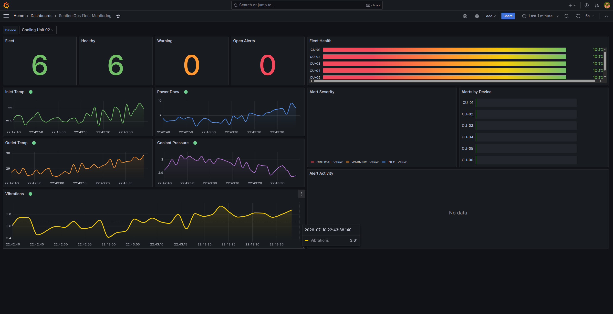
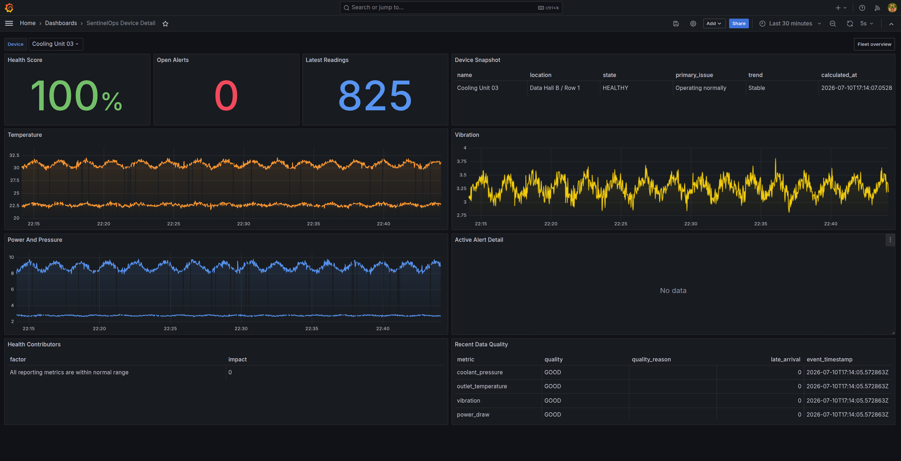
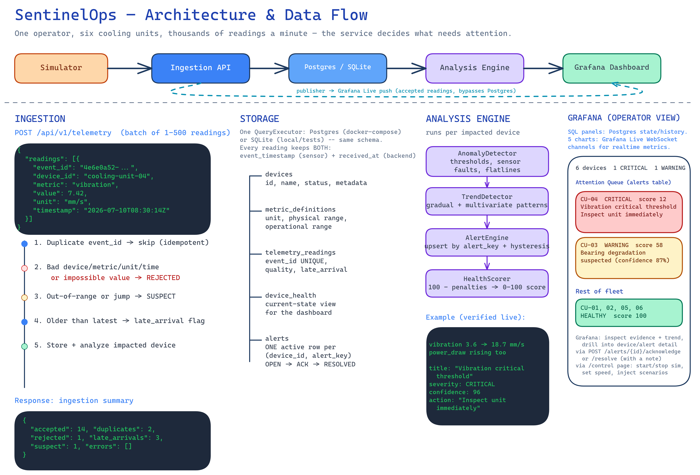
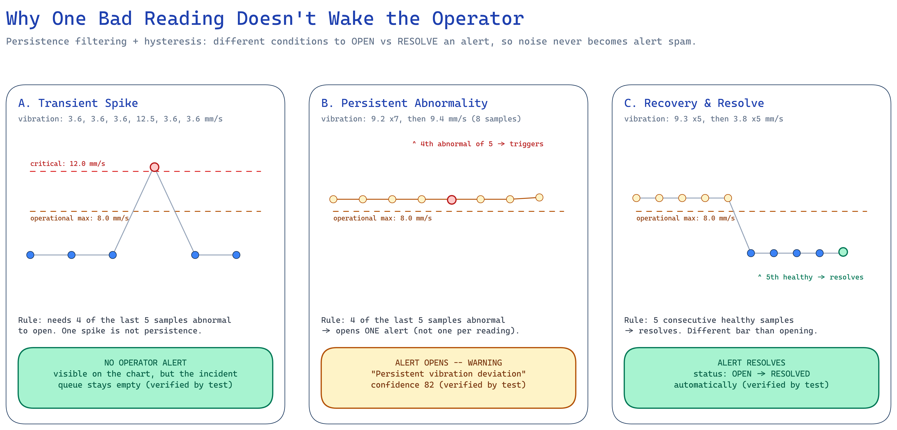
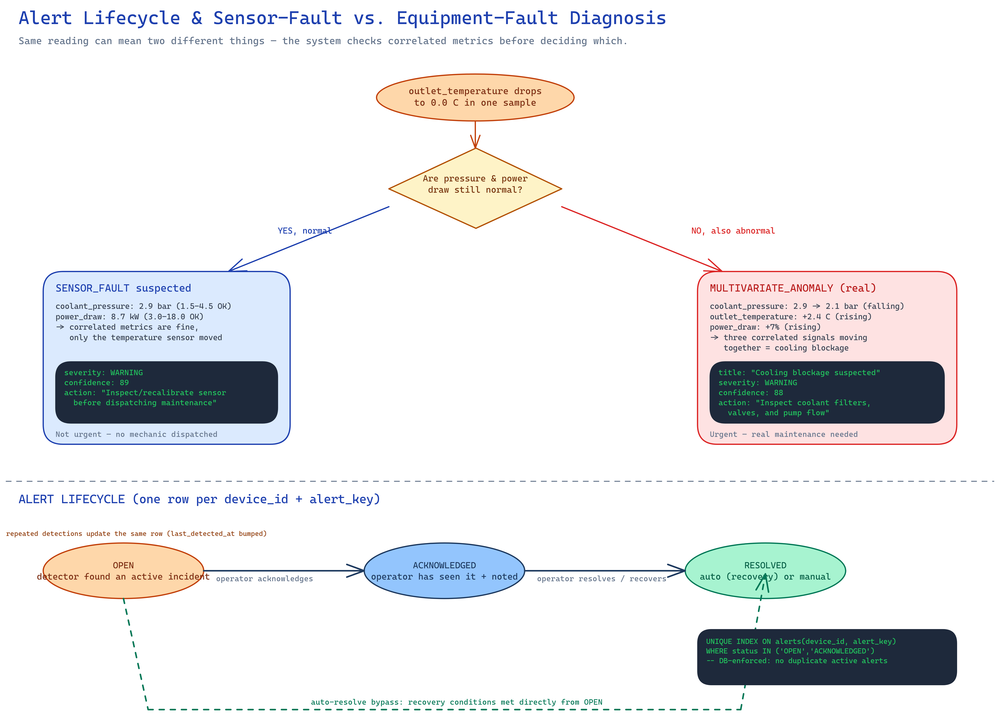

# SentinelOps

Explainable early-warning telemetry service for a small fleet of industrial cooling
units.

SentinelOps ingests simulated equipment telemetry, stores event-time readings,
scores device health, and turns noisy sensor values into operator-facing incidents.
The focus is the backend: ingestion, validation, data-quality handling, analysis,
alert lifecycle, and explainable recommendations. The operator dashboard is
**Grafana**, provisioned automatically with a Postgres datasource, Grafana Live
metric streams, and a fleet monitoring dashboard. The backend writes durable
operational data to Postgres and also publishes accepted telemetry to Grafana
Live's push API, so the five metric charts update through Grafana Live WebSockets
in the browser. A tiny plain-HTML `/control` page (served by the backend, no
build step) drives the simulator. Backend, Postgres, and Grafana are independent
services wired together with Docker Compose.

For runnable demo, testing, and troubleshooting commands, see
[`testing.md`](testing.md).

## Screenshots

| Fleet Monitoring | Device Detail |
| --- | --- |
| [](docs/screenshots/fleet-monitoring-dashboard.png) | [](docs/screenshots/device-detail-dashboard.png) |
| Fleet-wide health, open alerts, and per-metric live charts driven by Grafana Live. | Per-device health score, evidence, and recent data-quality flags. |

## Problem Interpretation

The assignment asks for a small version of a real monitoring problem: one operator
cannot watch many machines and thousands of readings, so the service should decide
what needs attention. I modeled six data-centre cooling units. Each unit reports:

- inlet temperature, `C`
- outlet temperature, `C`
- vibration, `mm/s`
- power draw, `kW`
- coolant pressure, `bar`

The service is optimized around four operator questions:

- Which machines are healthy?
- Which machines need attention now?
- Which machines are gradually deteriorating?
- Why does the system believe there is a problem?

## Product Overview

Each device gets a continuously updated health score from 0 to 100:

| Score | State | Meaning |
| --- | --- | --- |
| 85-100 | Healthy | Operating normally |
| 65-84 | Observe | Mild deviation or uncertainty |
| 40-64 | Warning | Persistent abnormal behavior |
| 0-39 | Critical | Serious fault or failure likely |

Alerts represent incidents, not individual bad readings. An alert includes severity,
affected device, evidence, duration, confidence, lifecycle status, and a recommended
operator action.

Example alert:

> Cooling Unit 04 - Bearing degradation suspected. Vibration increased while power
> draw rose in the same window, which is consistent with fan-bearing friction rather
> than a one-sample spike. Recommended action: inspect the fan bearing during the
> next maintenance window.

## Architecture

```text
Telemetry simulator
      |
      v
FastAPI ingestion API
      |
      +-- validation, idempotency, event-time storage
      +-- out-of-order and data-quality flags
      |
      v
SQLite (local/tests) or Postgres (Docker/demo) time-series tables
      |
      v
Analysis engine
      |
      +-- persistence filtering and hysteresis
      +-- safety thresholds
      +-- per-device trend detection
      +-- multivariate correlation rules
      +-- sensor-fault and missing-telemetry detection
      +-- health scoring and alert lifecycle
      |
      v
REST API  +  Grafana (Postgres snapshots + Live metric streams)  +  /control
```

SQLite remains the default for local development and the test suite — no setup
required. When `SENTINELOPS_DATABASE_URL` is set (as it is in `docker-compose.yml`),
the backend writes to Postgres instead, using the identical schema. Grafana uses
Postgres for fleet state, health, alerts, and historical tables. For the five
high-frequency metric charts, the backend also publishes each accepted reading to
Grafana Live channels named `stream/sentinelops/<device_id>.<metric>`, which the
dashboard receives over WebSockets. Both database adapters implement the same
narrow `QueryExecutor` protocol, so repositories and services never know which
database is active.

### Flow Diagrams

Editable sources are in [`docs/Flowcharts`](docs/Flowcharts) (`.excalidraw`,
open at [excalidraw.com](https://excalidraw.com)).

[](docs/Flowcharts/01-architecture-flow.png)
*End-to-end path: simulator to ingestion API, Postgres/SQLite storage, the
analysis pipeline, and Grafana — including the Grafana Live push that bypasses
Postgres for the realtime charts.*

[](docs/Flowcharts/02-detection-hysteresis.png)
*Why a single bad reading never becomes an alert: opening requires 4 of the
last 5 samples abnormal; resolving requires 5 consecutive healthy samples.*

[](docs/Flowcharts/03-lifecycle-and-diagnosis.png)
*How the same anomalous reading is triaged as a sensor fault versus a real
equipment fault, and how alerts move through OPEN -> ACKNOWLEDGED -> RESOLVED.*

## Repository Structure

```text
sentinel-ops/
├── backend/
│   ├── app/
│   │   ├── api/
│   │   │   └── routes/       # includes control.py (GET /control)
│   │   ├── analysis/
│   │   │   ├── anomaly_detector.py
│   │   │   ├── trend_detector.py
│   │   │   ├── health_score.py
│   │   │   ├── alert_engine.py
│   │   │   └── engine.py
│   │   ├── ingestion/
│   │   ├── models/
│   │   ├── repositories/      # sqlite.py, postgres.py (same QueryExecutor protocol)
│   │   ├── schemas/
│   │   ├── services/
│   │   ├── simulation/
│   │   ├── config.py
│   │   ├── container.py
│   │   └── main.py
│   ├── tests/
│   ├── migrations/
│   └── Dockerfile
├── grafana/
│   ├── provisioning/
│   │   ├── datasources/postgres.yml
│   │   └── dashboards/sentinelops.yml
│   └── dashboards/
│       ├── sentinelops.json
│       ├── sentinelops-device-detail.json
│       └── sentinelops-alert-detail.json
├── docs/
│   ├── architecture.md
│   ├── detection-strategy.md
│   ├── Flowcharts/            # .excalidraw sources + rendered .png
│   └── screenshots/           # Grafana dashboard screenshots
├── docker-compose.yml
├── Makefile
├── pyproject.toml
├── .env.example
├── README.md
└── LICENSE
```

## SOLID-Oriented Design

The code is organized around small responsibilities:

- API routers only translate HTTP requests into service calls.
- `TelemetryValidator` validates and classifies readings; it does not store data.
- `TelemetryService` owns ingestion workflow and idempotency.
- `AnomalyDetector`, `TrendDetector`, `AlertEngine`, and `HealthScorer` each own a
  separate analysis concern.
- `AnalysisEngine` composes those components rather than embedding every rule.
- `FleetRepository` isolates dashboard read models from route handlers;
  `SqliteDatabase` and `PostgresDatabase` isolate persistence behind the same
  `QueryExecutor` protocol, so swapping the database never touches repositories,
  services, or routes.
- `container.py` is the composition root where concrete dependencies are assembled.

This keeps the core domain logic testable without FastAPI and makes future
extensions safer: new detectors can be added without rewriting ingestion, routes,
or scoring.

## Running Locally

The recommended way to demo the project is Docker Compose, which starts the
backend, Postgres, and Grafana together:

```bash
docker compose up --build
```

Open:

| Service | URL | Purpose |
| --- | --- | --- |
| Grafana | `http://localhost:3001` | Operator dashboard (auto-provisioned datasource + "SentinelOps Fleet Monitoring" dashboard). Default login `admin` / `admin`, or browse anonymously. |
| Backend API | `http://localhost:8000` | REST API, unchanged contract |
| Control page | `http://localhost:8000/control` | Start/stop/reset the simulator, change speed, inject scenarios |
| API docs | `http://localhost:8000/docs` | OpenAPI/Swagger UI |

In this mode the backend writes to Postgres (`SENTINELOPS_DATABASE_URL`, set in
`docker-compose.yml`) and publishes accepted readings to
`http://grafana:3000/api/live/push/sentinelops`. Grafana still queries Postgres
directly for summary cards and tables, while the metric charts subscribe to
Grafana Live for a realtime feel.

### Running the backend without Docker (SQLite mode)

```bash
python3 -m venv .venv
source .venv/bin/activate
python3 -m pip install -e ".[dev]"
python3 -m uvicorn backend.app.main:create_app --factory --reload --host 0.0.0.0 --port 8000
```

With no `SENTINELOPS_DATABASE_URL` set, the backend falls back to SQLite at
`SENTINELOPS_DB_PATH` (default `./sentinel_ops.sqlite3`) — the same mode the test
suite uses. Open `http://localhost:8000/control` for simulator controls; there is
no Grafana in this mode unless you point it at the SQLite file yourself.

The simulator starts automatically. The control page and API let you inject:

- transient vibration spike
- gradual bearing degradation
- cooling blockage
- sensor fault
- missing telemetry
- sudden failure

Run tests:

```bash
python3 -m pytest backend/tests -q
```

## API

Core endpoints:

| Method | Path | Purpose |
| --- | --- | --- |
| `POST` | `/api/v1/telemetry` | Batch telemetry ingestion |
| `GET` | `/api/v1/fleet/summary` | Fleet counts and attention queue |
| `GET` | `/api/v1/devices` | Urgency-sorted device list |
| `GET` | `/api/v1/devices/{device_id}` | Device detail |
| `GET` | `/api/v1/devices/{device_id}/telemetry` | Recent readings |
| `GET` | `/api/v1/devices/{device_id}/health` | Recalculate and return health |
| `GET` | `/api/v1/alerts` | Active or historical alerts |
| `POST` | `/api/v1/alerts/{alert_id}/acknowledge` | Acknowledge alert with optional note |
| `POST` | `/api/v1/alerts/{alert_id}/resolve` | Resolve alert with optional note |
| `POST` | `/api/v1/simulation/start` | Start simulator |
| `POST` | `/api/v1/simulation/stop` | Stop simulator |
| `POST` | `/api/v1/simulation/speed` | Change simulation speed |
| `POST` | `/api/v1/simulation/inject` | Inject a scenario |
| `POST` | `/api/v1/simulation/reset` | Clear readings and reset scenarios |
| `GET` | `/health` | Liveness |
| `GET` | `/ready` | Database readiness |

Telemetry batch payload:

```json
{
  "readings": [
    {
      "event_id": "4e6e0a52-774d-46f0-91f6-928bec205a19",
      "device_id": "cooling-unit-04",
      "metric": "vibration",
      "value": 7.42,
      "unit": "mm/s",
      "timestamp": "2026-07-10T08:30:14Z"
    }
  ]
}
```

Ingestion response:

```json
{
  "accepted": 14,
  "duplicates": 2,
  "rejected": 1,
  "late_arrivals": 3,
  "suspect": 1,
  "errors": []
}
```

## Detection Strategy

The detection engine is intentionally hybrid and explainable. It does not pretend
that simulated data supports a black-box predictive model.

Data-quality layer:

- rejects unknown devices, unknown metrics, wrong units, non-finite values, future
  timestamps, and physically impossible values
- stores suspicious but plausible values as `SUSPECT`
- tracks late arrivals using sensor event time versus backend receive time
- detects missing metrics and flatlined sensors
- detects full-device telemetry silence against the rest of the fleet
- separates likely sensor faults from equipment faults

Safety layer:

- deterministic critical thresholds for conditions that require immediate attention
- examples: high vibration, very high temperature, low coolant pressure, motor stop

Persistence layer:

- one isolated bad reading is not enough for an operator alert
- persistent threshold alerts require 4 of the last 5 samples to be abnormal
- resolved threshold alerts require 5 consecutive healthy readings

Trend layer:

- compares recent values to the same device's earlier readings in the rolling window
- detects gradual bearing degradation from rising vibration plus rising power draw
- estimates projected crossing time for the vibration operating limit when the slope
  is meaningful

Multivariate layer:

- cooling blockage is detected from falling pressure, rising outlet temperature, and
  rising power draw
- zero temperature with normal power and pressure is classified as a suspected sensor
  fault instead of an equipment failure

Health scoring:

- starts from 100
- subtracts explainable penalties for active incidents and recent suspect data
- maps the score to `HEALTHY`, `OBSERVE`, `WARNING`, or `CRITICAL`
- stores contributors so the dashboard can show why the score changed

The weights are configurable prototype heuristics, not scientifically validated
maintenance models.

## Simulated Scenarios

Normal operation:

- values fluctuate around device-specific baselines
- each unit has a slightly different load phase and baseline

Bearing degradation:

- vibration rises gradually
- power draw rises more mildly
- outlet temperature rises later

Cooling blockage:

- coolant pressure falls
- outlet temperature rises
- power draw rises

Sensor fault:

- an inlet or outlet temperature sensor reports zero
- correlated power and pressure stay normal

Transient spike:

- vibration spikes for two ticks and returns to normal
- the chart shows it, but no persistent operator alert is opened

Missing telemetry:

- one metric stops reporting while other metrics continue
- the service creates a data-quality incident

Device offline:

- all metrics from a device stop while the rest of the fleet continues reporting
- the service raises a device-level connectivity/power incident

Sudden failure:

- power draw collapses and vibration becomes zero
- the system raises a critical incident, while acknowledging this may not have been
  predictable in advance

## Alert Lifecycle

Alerts use:

```text
OPEN -> ACKNOWLEDGED -> RESOLVED
```

Repeated abnormal readings update the same active alert rather than creating an
append-only stream of duplicate alerts. Operators acknowledge or resolve alerts
with an optional note through `POST /api/v1/alerts/{alert_id}/acknowledge` and
`.../resolve`; Grafana surfaces the active alert and its evidence for triage.

## Tests

The test suite covers:

- valid ingestion
- duplicate event IDs
- invalid metrics and units
- future timestamp rejection
- partial batch acceptance
- out-of-order readings
- spike suppression
- persistent alert creation without duplicates
- automatic resolution after healthy readings
- gradual degradation warning
- sensor fault classification
- missing telemetry alerts
- full-device offline alerts
- health score changes for healthy and critical states

## Assumptions

- The fleet contains six cooling units.
- Telemetry normally arrives every five seconds.
- Device IDs and metric definitions are known ahead of time.
- The prototype has no historical maintenance labels.
- "Predicted failure" means projected deterioration or threshold crossing, not a
  guaranteed remaining useful life estimate.
- Device authentication, tenancy, and user management are excluded.
- SQLite is acceptable for a local assignment; the schema is designed to move to a
  time-series database later.

## Limitations

- Simulated data cannot represent every real operating condition.
- The heuristic thresholds are explainable but not calibrated from real failures.
- Remaining useful life would require labelled historical failures and maintenance
  outcomes.
- Sudden failures may provide no useful warning.
- Recommendations should eventually come from equipment-specific maintenance
  knowledge.
- A production system needs access control, audit logs, retention policies,
  observability, backups, and operator notification integrations.

## Production Evolution

At larger scale I would evolve the architecture toward:

```text
Sensors / gateways
      |
      v
MQTT or Kafka
      |
      v
Stateless ingestion consumers
      |
      v
Stream processing with event-time windows
      |
      v
TimescaleDB, ClickHouse, or managed time-series storage
      |
      v
Detection and scoring services
      |
      v
Alerting, notification, and operator workflow
```

Specific upgrades:

- Kafka partitions by device ID
- Flink or Kafka Streams for event-time windowing and watermarks
- Redis for recent device state
- model registry for device-specific baselines
- Prometheus and OpenTelemetry for service observability
- role-based access control and audit logs
- PagerDuty, email, SMS, or ticketing integrations
- multi-tenant isolation

Event time versus processing time matters here. The service stores both
`event_timestamp` and `received_at` so late and out-of-order telemetry can be
observed instead of silently corrupting analysis.

## Screen Recording Outline

A five to eight minute walkthrough can use this flow:

1. Show the architecture and fleet overview.
2. Show healthy live readings and no unnecessary alerts.
3. Inject a transient spike and show that it is not turned into an operator alert.
4. Inject bearing degradation and show health score decline, warning creation, and
   explanatory evidence.
5. Inject a temperature sensor fault and show that it is not classified as equipment
   failure.
6. Acknowledge and resolve an alert.
7. Close with the ingestion, deduplication, hysteresis, tests, and production-scale
   trade-offs.
